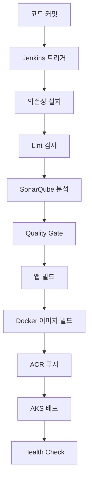

# 프론트엔드 Jenkins CI/CD 파이프라인 구축 가이드

## 개요

이 문서는 phonebill-front 프로젝트를 위한 Jenkins + Kustomize 기반 CI/CD 파이프라인 구축 가이드입니다.

### 시스템 정보
- **시스템명**: phonebill
- **서비스명**: phonebill-front
- **ACR 이름**: acrdigitalgarage01
- **리소스 그룹**: rg-digitalgarage-01
- **AKS 클러스터**: aks-digitalgarage-01

## 1. Jenkins 서버 환경 구성

### 1.1 Jenkins 필수 플러그인 설치

Jenkins 관리 > 플러그인 관리에서 다음 플러그인들을 설치하세요:

```
- Kubernetes
- Pipeline Utility Steps
- Docker Pipeline
- GitHub
- SonarQube Scanner
- Azure Credentials
- EnvInject Plugin
```

### 1.2 Jenkins Credentials 등록

#### Azure Service Principal
```
경로: Manage Jenkins > Credentials > Add Credentials
- Kind: Microsoft Azure Service Principal
- ID: azure-credentials
- Subscription ID: {구독ID}
- Client ID: {클라이언트ID}
- Client Secret: {클라이언트시크릿}
- Tenant ID: {테넌트ID}
- Azure Environment: Azure
```

#### ACR Credentials
```
- Kind: Username with password
- ID: acr-credentials
- Username: acrdigitalgarage01
- Password: {ACR_PASSWORD}
```

#### Docker Hub Credentials (Rate Limit 해결용)
```
- Kind: Username with password
- ID: dockerhub-credentials
- Username: {DOCKERHUB_USERNAME}
- Password: {DOCKERHUB_PASSWORD}
```

#### SonarQube Token
```
- Kind: Secret text
- ID: sonarqube-token
- Secret: {SonarQube토큰}
```

### 1.3 Node.js 도구 설정

Jenkins 관리 > Global Tool Configuration에서:
- **Node.js 설치 추가**
- 이름: `18`
- Version: `18.x.x`

## 2. 프로젝트 구조

### 2.1 Kustomize 디렉토리 구조

```
k8s/
├── base/
│   ├── deployment.yaml
│   ├── service.yaml
│   └── kustomization.yaml
└── overlays/
    ├── dev/
    │   ├── kustomization.yaml
    │   ├── deployment-dev.yaml
    │   └── config.env
    ├── staging/
    │   ├── kustomization.yaml
    │   ├── deployment-staging.yaml
    │   └── config.env
    └── prod/
        ├── kustomization.yaml
        ├── deployment-prod.yaml
        └── config.env
```

### 2.2 주요 파일 설명

#### Base Deployment (k8s/base/deployment.yaml)
- 기본 배포 설정
- 2개 replica, 리소스 제한 설정
- Health check 포함

#### Environment Overlays
- **dev**: 1 replica, 최소 리소스
- **staging**: 2 replica, 중간 리소스
- **prod**: 3 replica, 최대 리소스

#### 환경별 설정 (config.env)
- REACT_APP_ENV: 환경 식별자
- REACT_APP_API_URL: 백엔드 API URL
- REACT_APP_LOG_LEVEL: 로그 레벨

## 3. Jenkins 파이프라인

### 3.1 Jenkinsfile 주요 기능

1. **환경 설정**: 브랜치별 자동 환경 매핑
   - `main` → `prod`
   - `staging` → `staging`
   - 기타 → `dev`

2. **단계별 처리**:
   - Checkout & Git 정보 수집
   - Dependencies 설치
   - Lint 검사
   - SonarQube 코드 품질 분석
   - Quality Gate 검증
   - Application 빌드
   - Docker 이미지 빌드
   - ACR 푸시
   - AKS 배포
   - Health Check

3. **이미지 태깅**:
   - `{environment}-{build-number}-{git-commit-short}`
   - 예: `dev-123-abc1234`

### 3.2 파이프라인 실행 흐름



## 4. SonarQube 설정

### 4.1 SonarQube 프로젝트 설정

SonarQube에서 새 프로젝트 생성:
- **Project Key**: phonebill-front
- **Project Name**: phonebill-front

### 4.2 Quality Gate 규칙

- Coverage: ≥ 80%
- Duplicated Lines: < 3%
- Maintainability Rating: A
- Reliability Rating: A
- Security Rating: A

## 5. 수동 배포 스크립트

### 5.1 스크립트 사용법

```bash
# 개발 환경에 latest 이미지 배포
./scripts/deploy.sh dev

# 프로덕션 환경에 특정 태그 배포  
./scripts/deploy.sh prod v1.2.3

# 스테이징 환경에 특정 빌드 배포
./scripts/deploy.sh staging dev-123-abc123
```

### 5.2 스크립트 기능

- ✅ 환경 검증 및 이미지 존재 확인
- ✅ 자동 백업 생성
- ✅ Kustomize 기반 배포
- ✅ 배포 상태 모니터링
- ✅ Health Check 수행
- ✅ 롤백 안내 제공

## 6. 환경별 배포 전략

### 6.1 개발 환경 (dev)
- **트리거**: feature 브랜치 푸시
- **자동 배포**: 모든 테스트 통과 시
- **리소스**: 최소 (1 replica)

### 6.2 스테이징 환경 (staging)
- **트리거**: staging 브랜치 푸시
- **자동 배포**: Quality Gate 통과 시
- **리소스**: 중간 (2 replica)

### 6.3 프로덕션 환경 (prod)
- **트리거**: main 브랜치 푸시
- **자동 배포**: 모든 검증 통과 시
- **리소스**: 최대 (3 replica)

## 7. 모니터링 및 알림

### 7.1 배포 상태 확인

```bash
# 배포 상태 확인
kubectl rollout status deployment/phonebill-front -n {environment}

# Pod 상태 확인
kubectl get pods -n {environment} -l app=phonebill-front

# 서비스 상태 확인
kubectl get svc -n {environment} -l app=phonebill-front
```

### 7.2 로그 확인

```bash
# 애플리케이션 로그
kubectl logs -f deployment/phonebill-front -n {environment}

# 이벤트 확인
kubectl get events -n {environment} --sort-by='.lastTimestamp'
```

## 8. 트러블슈팅

### 8.1 일반적인 문제 해결

#### 배포 실패 시
1. Jenkins 콘솔 로그 확인
2. Kubernetes 이벤트 확인
3. 이미지 태그 확인
4. 리소스 할당량 확인

#### Quality Gate 실패 시
1. SonarQube 대시보드 확인
2. 코드 품질 이슈 수정
3. 테스트 커버리지 개선

#### Docker 이미지 빌드 실패 시
1. Dockerfile 문법 확인
2. 의존성 설치 확인
3. Docker Hub Rate Limit 확인

### 8.2 롤백 방법

```bash
# 이전 버전으로 롤백
kubectl rollout undo deployment/phonebill-front -n {environment}

# 특정 리비전으로 롤백
kubectl rollout undo deployment/phonebill-front -n {environment} --to-revision=2

# 롤아웃 히스토리 확인
kubectl rollout history deployment/phonebill-front -n {environment}
```

## 9. 보안 고려사항

### 9.1 시크릿 관리
- 모든 인증 정보는 Jenkins Credentials에 저장
- 환경 변수를 통한 시크릿 전달
- ACR 토큰 정기 갱신

### 9.2 이미지 보안
- 베이스 이미지 취약점 스캔
- 최소 권한 원칙 적용
- 정기적인 보안 업데이트

## 10. 성능 최적화

### 10.1 빌드 최적화
- Docker 레이어 캐싱 활용
- 멀티 스테이지 빌드 사용
- npm ci 사용으로 빠른 설치

### 10.2 배포 최적화
- Rolling Update 전략 사용
- Health Check를 통한 안전한 배포
- 리소스 제한으로 안정성 확보

## 11. 확장 계획

### 11.1 추가 기능
- [ ] Helm Chart 마이그레이션
- [ ] GitOps (ArgoCD) 도입
- [ ] 자동 스케일링 설정
- [ ] 모니터링 대시보드 구축

### 11.2 CI/CD 개선
- [ ] 병렬 테스트 실행
- [ ] 성능 테스트 자동화
- [ ] 보안 스캔 통합
- [ ] 배포 승인 워크플로우

---

## 문의 및 지원

문제가 발생하거나 개선 사항이 있으면 DevOps 팀에 문의하세요.

**작성일**: 2025-09-13  
**버전**: 1.0  
**작성자**: Jenkins CI/CD Team